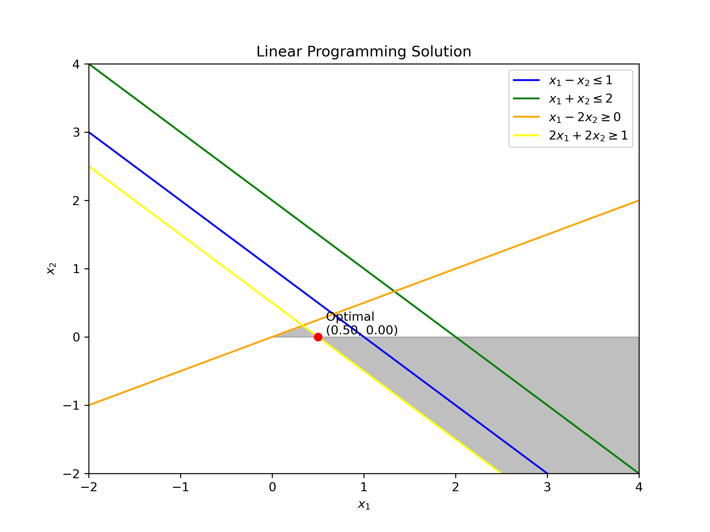

# Operational_Research_uwm
*small project, using pyomo library*
### Exercise 1

>#### **Compared to exam:** I've achieved different results.

### Exercise 2

```commandline
Total Shipping Costs =  250.0

Shipping Table:
Ship from  Supplier1  to  Customer4 : 25.0
Ship from  Supplier1  to  Fictional_Customer : 5.0
Ship from  Supplier2  to  Customer1 : 25.0
Ship from  Supplier2  to  Customer3 : 5.0
Ship from  Supplier2  to  Customer4 : 5.0
Ship from  Supplier3  to  Customer2 : 25.0
Ship from  Supplier3  to  Customer3 : 35.0
```
>#### **Compared to exam:** I've achieved the same results.

### Sources
* [Optimization @ UWM](https://uwmopt.github.io/) - webpage of the subject.
* My pal - Jan Karaś
